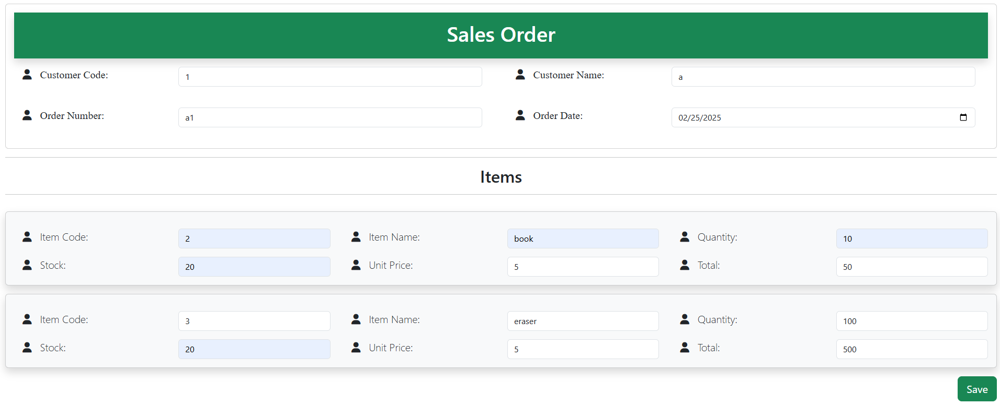
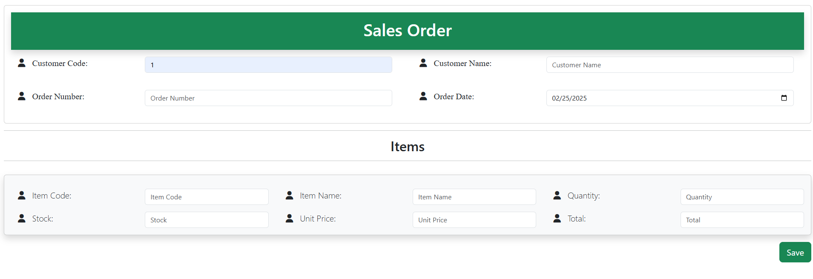
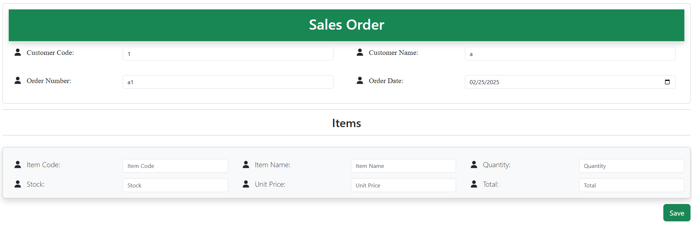
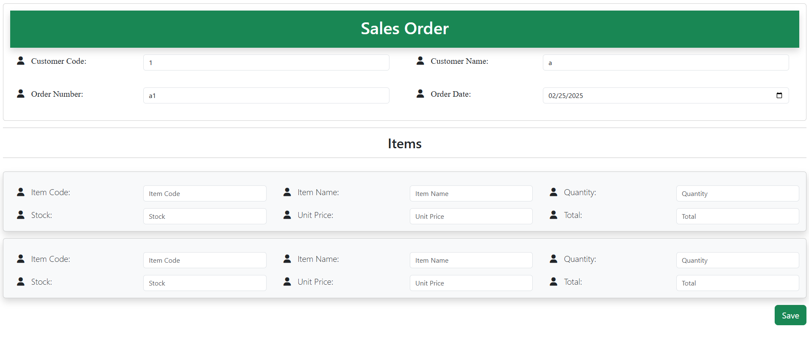
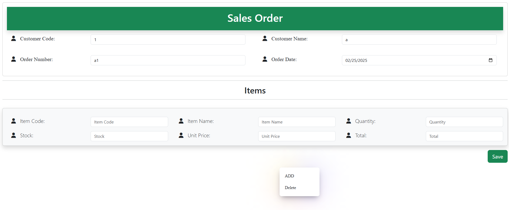
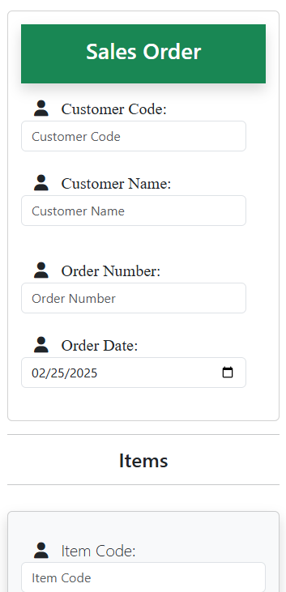

# DjangoShop

A Django web app for managing sales orders — enter a customer, pull in items from the catalog, and build out an order line-by-line through a fast, card-based form with right-click quick actions.

## Features

- 📅 **Auto date-stamping** — the order date field is always set to the current date automatically
- 🖱️ **Right-click context menu** — quick actions available via mouse right-click on order cards
- ➕➖ **Dynamic item rows** — add or remove item cards/columns on the order form as needed
- ✏️ **Inline editing** — edit item or order values directly on the card before submitting
- ⌨️ **Enter-to-submit** — pressing Enter on the customer code field submits/looks up the customer without needing the main save button
- 💾 **Order-level save** — a dedicated button submits the full order (customer + all item lines) in one request
- 📱 **Responsive layout** — built on Bootstrap 5, so it adapts to mobile screens
- 🗂️ **Django admin** — `Customer`, `Item`, and `Order` records are registered and manageable from `/admin/`

## Screenshots

| Items Input | Items Output |
|---|---|
|  |  |

| Sales Order Input | Sales Order Output |
|---|---|
|  |  |

| Adding Data | Right-Click Menu | Mobile View |
|---|---|---|
|  |  |  |

## Tech Stack

- **Backend:** Python, Django 5.1
- **Database:** SQLite (`db.sqlite3`, Django's default)
- **Frontend:** Bootstrap 5, Font Awesome, Typed.js (via CDN), vanilla JavaScript, custom CSS

## Project Structure

```
DjangoShop/
├── ERM/                       # Django project root
│   ├── ERM/                   # Project config (settings, urls, wsgi/asgi)
│   ├── ERMapp/                # Main app
│   │   ├── models.py          # Customer, Item, Order
│   │   ├── views.py           # home, homefunc (customer lookup), formvalue (order submit)
│   │   ├── urls.py            # app routes: '', 'home/', 'order/'
│   │   ├── admin.py           # registers Customer, Item, Order
│   │   ├── templates/ERMapp/  # demo.html, index.html
│   │   └── static/ERMapp/     # mouse.css
│   ├── db.sqlite3
│   └── manage.py
├── README.md
└── *.png                      # UI screenshots referenced above
```

## Data Model

- **Customer** — `customerCode`, `name`, `orderNumber`
- **Item** — `itemCode`, `itemName`, `description`, `unitPrice`, `stock`
- **Order** — links a customer's order details (code, name, order number/date) to an item line (item code/name, quantity, unit price, stock, total)

## Getting Started

### Prerequisites

- Python 3.x
- pip
- (recommended) `venv` for a virtual environment

### Installation

1. **Clone the repository**
   ```bash
   git clone https://github.com/PIYAL-DATTA/DjangoShop.git
   cd DjangoShop/ERM
   ```

2. **Create and activate a virtual environment**
   ```bash
   python -m venv venv
   source venv/bin/activate      # On Windows: venv\Scripts\activate
   ```

3. **Install Django**
   ```bash
   pip install django
   ```

4. **Apply migrations**
   ```bash
   python manage.py migrate
   ```

5. **Run the development server**
   ```bash
   python manage.py runserver
   ```

6. Open your browser to `http://127.0.0.1:8000/` for the app, or `http://127.0.0.1:8000/admin/` for the Django admin (create a superuser first with `python manage.py createsuperuser` if you want admin access).

## Usage

1. Enter a **Customer Code** on the Sales Order form — pressing Enter (or triggering the field's change event) looks up the customer automatically.
2. Add item rows to the order; right-click a card for quick actions.
3. Adjust quantities, prices, or stock inline as needed — totals are calculated per line.
4. Hit the **Save** button to submit the full order, which is written to the `Order` table.

## Contributing

Contributions, issues, and feature requests are welcome — feel free to open a pull request or submit an issue.

## Author

**Piyal Datta**
[GitHub](https://github.com/PIYAL-DATTA)

## License

No license specified yet — consider adding one (e.g. MIT) if you plan to accept outside contributions.
